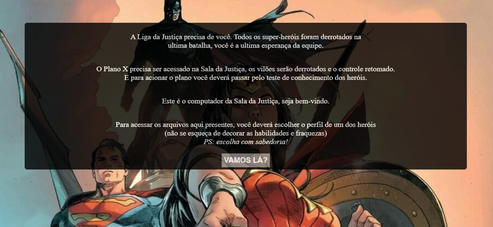
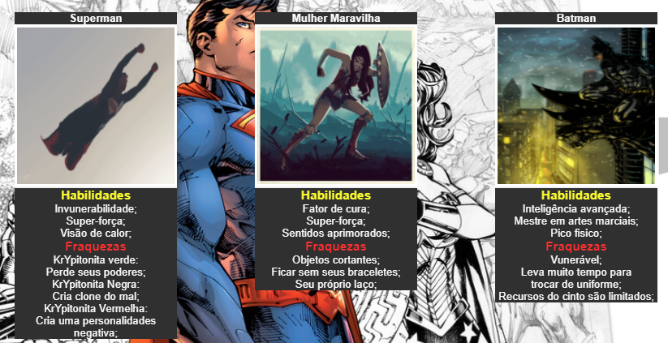
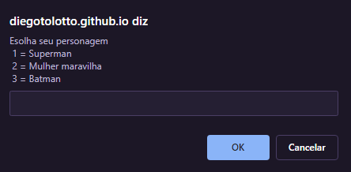
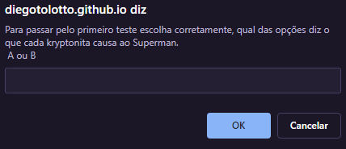

# Projeto final de modulo 1

## Jogo de escolhas

O projeto final de modulo 1 foi proposto pra que pudessemos exercitar e melhorar nossas praticas com:
- HTML5;
- CSS3;
- JavaScript;

O Tema escolhido pelo meu grupo foi DC Comics, e os personagens que usamos foram o batman, super homem e a mulher maravilha. 

Este é o enredo da historia que eu criei:

## Para jogar
O jogo pede para que o jogador faça a sua escolha do personagem, logo após deve-se prestar atenção nas habilidades dos herois e nas fraquezas. 

Para passar adiante nas fases deve-se preencher o prompt:

- com 1, 2 ou 3:

- Ou A e B:

## Status do Projeto
O projeto neste momento se encontra em desenvolvimento, será um projeto que levarei a diante para poder praticar minhas habilidades nas tecnologias usadas. 

## Integrantes do projeto:

O projeto foi proposta pela Resilia. Os Grupos foram montados para escolha do tema, e os paticipantes do meu grupo eram:
- Hadassa Morais;
- Fernanda Barreto;
- Diego Nunes Tolotto;

